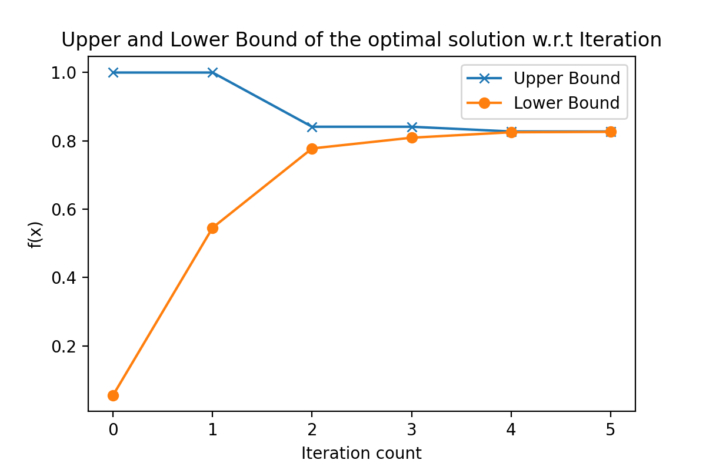

# Durandal
Durandal is a convex NLP solver based on a successive linear programming technique. Uses the principle of supporting hyperplanes of convex functions to solve the problem, also known as Kelley's Method. This cutting procedure is where we get the solver's name from, the legendary sword Durandal.  

Currently, Durandal is very experimental and is a personal project.

## How to install

```bash
pip install durandal
```

## Features

- [x] - Solve NLPs via a series of converging LPs
- [x] - Dynamic removal of cuts as they become redundant
- [ ] - Frank-Wolfe style optional step rules
- [ ] - Chebychev ball style optional step rules
- [ ] - Trust Region
- [ ] - A more generic LP interface for other LP solvers

## Requriments (Restrictions)

* Only affine constraints are supported
* Feasible space must be bounded
* The objective function & gradiant must be bounded inside the feasible space
* The objective function must be convex (nonconvex are allowed, but no convergence guarantees are given)

## How does it work?

This algorithm forms a converging sequence of upper and lower bounds on the objective function by introducing cuts in the form of supporting hyperplanes of the objective function. Additionally, the candidate solution is always feasible so that it can be interrupted at any point in the method and still yeild a feasible approximate optimum. The core kernel of this routine is the generation of supporting hyperplanes and re-optimizing the central LP problem. This re-optimization warm started as the dual of the central LP is feasible after introducing the cut. Each visited point generates a supporting hyperplane which translates to a constraint/cut in the LP.

$$
\Huge
\begin{align}
\min_{x,y} \quad \quad \quad &y\\
\text{s.t. }\quad   Ax &\leq b\\
\nabla f(x_i)^T(x-x_i) + f(x_i) &\leq y,  \quad \forall x_i \in \mathcal{P}\\
x\in\mathbb{R}^n&, y\in\mathbb{R}
\end{align}
$$

This procedure can basically be viewed as making approximations over the epigraph of the objective function over the feasible region and refining the approximation per iteration. 

## Should I use it?

### Is it free?

Yes

### Does it work?

Yes

## Example code of solving a 1D NLP

```python

from durandal.nlp import NLP
import numpy
import matplotlib.pyplot as plt

# define the convex nonlinear objective
def f(x):
    return numpy.exp(x) + x ** 2

# define the gradiant of the objective
def grad_f(x):
    return numpy.exp(x) + 2 * x

# Constrain x to have magnitude up to 2, |x| <= 2
A = numpy.array([[1], [-1]])
b = numpy.array([[2], [2]])

# construct the nlp solver object
nlp = NLP(f, grad_f, A, b)

# solve the NLP with up to 3 cuts while showing output
x_approx = nlp.solve(max_cuts=3, output=True)

# start from where the last solve started off and solve for another 10 cuts while again showing outputs
x_sol = nlp.solve(max_cuts= 10, output = True)

# reconstruct the nlp solver object
nlp = NLP(f, grad_f, A, b)

# here we use a callback to record the upper and lower bounds per iteration
lower_bounds = []
upper_bounds = []
def my_callback(cb_nlp:NLP):
    lower_bounds.append(cb_nlp.lb)
    upper_bounds.append(cb_nlp.ub)

nlp.solve(max_cuts=5, output=False, gen_callback=my_callback)

#show the change in lower bound w.r.t. iteration
plt.plot(upper_bounds,marker='x')
plt.plot(lower_bounds,marker='o')
plt.title('Upper and Lower Bound of the optimal solution w.r.t Iteration')
plt.ylabel('f(x)')
plt.xlabel('Iteration count')
plt.legend(['Upper Bound','Lower Bound'])
```

